# **API Testing: Postman**

# **Introduction**

This document provides an overview of what APIs are, how API testing
works, and how Postman is used to test them.

Modern applications depend heavily on backend services. Features such as
login, browsing products, payments, or profile updates all work through
APIs (Application Programming Interfaces). APIs allow two systems to
communicate by sending requests and receiving responses. To ensure that
these interactions work correctly, testers perform API
Testing---checking responses, status codes, data accuracy, error
handling, and performance. One of the most widely used tools for API
testing is Postman, known for its simple interface, readable responses,
and powerful testing features.

# **What is an API?**

An API (Application Programming Interface) is a set of rules that allows
different software applications to communicate. It defines how a request
is sent and how the response is structured. APIs act like a bridge
between the user and the server, commonly used in websites, mobile apps,
payment systems, and more.

# **How does API Works?**

An API functions like a restaurant waiter:

1.  User Sends a Request -- The user (customer) sends a request using a
    browser.

2.  API Takes the Request -- Like a waiter, it forwards the request to
    the server.

3.  Server Processes the Request -- The server (chef) prepares the data.

4.  Server Sends Back the Response -- Data is returned to the API.

5.  API Delivers Response to User -- The API sends the final output back
    to the user.

# **What is API Testing?**

API testing is a type of software testing done before frontend
integration. It tests the APIs directly to make sure the server works
correctly and gives the right response.

## **4.1 Goals of API Testing**

1.  **Ensure Functional Accuracy** -- API performs the correct
    operations and returns expected outputs.

2.  **Ensure Proper Status Handling** -- API returns appropriate HTTP
    codes for each scenario.

3.  **Ensure Performance Efficiency** -- API responds quickly and
    handles load smoothly.

4.  **Ensure Security Compliance** -- API is protected by proper
    authentication and authorization.

5.  **Ensure Data Integrity** -- Responses contain correct values,
    required fields, and valid JSON/XML format.

Before using Postman, it is important to understand HTTP methods and
status codes because they help you correctly interpret how an API
behaves and responds.

# **5. HTTP Methods**

Postman lets you test different **HTTP methods**, which tell the server
what type of action you want to perform:

- **GET** -- Gets data from the server, like fetching product details.

- **POST** -- Sends new data to the server, like creating a new order.

- **PUT** -- Updates existing data completely, like changing all info in
  a user profile.

- **PATCH** -- Updates part of existing data, like changing only an
  email or name.

- **DELETE** -- Removes data from the server, like deleting a user
  account.

- **HEAD** -- Gets only the response headers without the data, useful to
  check if a resource exists.

- **OPTIONS** -- Shows which HTTP methods are allowed for a resource,
  useful to check API capabilities.

# **6. HTTP Status Code**

An HTTP response code **is a** three-digit number that a server sends to
indicate the result of a request. It helps clients (browsers, Postman,
APIs) understand whether the request was successful, redirected, or
encountered an error. Some common response codes are:

1.  **1xx -- Informational**: Request received and processing is
    continuing.

2.  **2xx -- Success**: Request was successfully received and processed.

3.  **3xx -- Redirection**: Additional action is required to complete
    the request.

4.  **4xx -- Client Error**: The request has an issue from the client
    side.

5.  **5xx -- Server Error**: The server failed to process a valid
    request.

# **7. Postman**

Postman is a tool used to test APIs. It lets you send requests to a
server, see the responses, and check if the API is working correctly.
You can organize requests, reuse values like URLs or tokens, write
simple tests, see request history, and share with your team. It makes
API testing easy for beginners.

**Advantages of Postman**

- Easy to use with a visual interface.

- Organize multiple requests in collections.

- Responses are formatted and easy to read.

- Can write simple tests and automate checks.

- Easy to share requests with team members.

**Limitations of Postman**

- Can be heavy on memory for large collections.

- Not ideal for very complex automation (needs additional tools).

- Some features require a paid version.

# 8. **Postman: Setting Up Workspaces, Collections, and Environments in Postman**

# **8.1 Creating a New Workspace**

A workspace in Postman helps you organize your APIs, collections,
environments, and test data in one place.

Steps:

1.  Open Postman.

2.  Click on Workspaces at the top-left corner.

3.  Select Create Workspace.

4.  Give your workspace a name (e.g., "API Testing Practice").

5.  Add a short description (optional).

6.  Choose Workspace Type:

      - Personal -- only you can access it (best for practicing).

      - Team -- shared with your team.

7.  Click Create Workspace.

Your new workspace is now ready, and you can start organizing your API
testing work inside it.

## **8.2 Creating or Importing a Collection**

A collection groups multiple API requests and helps you test them in an
organized way.

To create a new collection:

1.  In the left panel, click Collections.

2.  Click + New Collection.

3.  Give it a name (e.g., "GoREST API Testing").

4.  Add a small description if needed.

5.  Click Create.

To import a collection:

1.  Click Import (top-left).

2.  Choose:

    - File

    - Link (URL)

    - Raw text

3.  Upload or paste the collection.

4.  Click Import.

## **8.3 Creating an Environment**

Environments allow you to store variables such as base URLs, tokens, and
IDs. This helps you avoid rewriting the same values repeatedly.
Environment variables can be local to a specific workspace or shared
across multiple workspaces, making them easily accessible wherever
needed for your API requests.

Steps:

1.  Click the Environment dropdown on the top-right.

2.  Click on the "+" to add new.

3.  Give the environment a name (e.g., "GoREST Environment").

4.  Add variables such as:

     - base_url → https://gorest.co.in/public/v2

    - token → your API token

    - user_id → will be stored after creating a user

5.  Enter Initial Value and Current Value.

6.  Click Save.

Now your environment is ready for use.

## **8.4 Using Environment Variables in Requests**

Environment variables make requests dynamic, reusable, and easier to
manage. Instead of hardcoding values like URLs or tokens, variables can
be reused across multiple requests.

- Variable Format

In Postman, variables must be written using double curly braces:

**{{variable_name}}**

- Postman automatically replaces the variable with its value from the
  selected environment when the request is sent.

- Example Usage in Requests

**Request URL**

**{{base_url}}/users**

- Headers

**Authorization: Bearer {{token}}**

- When the request is executed, Postman replaces {{base_url}} and
  {{token}} with the actual values stored in the active environment.

- **Example Environment Variable Setup**

| Variable Name | Example Value                  |
|---------------|--------------------------------|
| base_url      | https://gorest.co.in/public/v2 |
| token         | your_access_token_here         |
| user_id       | 12345                          |

# **9. Testing GoREST Demo API -- Step by Step**

The GoRest Demo API was used for practicing different HTTP methods.

API Base URL:
[**[[https://gorest.co.in/public/v2]{.underline}]{.mark}**](https://gorest.co.in/public/v2)

## **9.1 Initial Setup in Postman**

Before testing APIs, set up your workspace, collection, and environment:

1.  Open Postman -- Launch the app and log in.

2.  Create a Workspace -- Workspaces help organize requests. Navigate to
    Workspaces → Create Workspace, give a name (e.g., GoRest API
    Testing), and select Personal or Team.

3.  Create a Collection -- Collections group related API requests. Click
    New → Collection, name it (e.g., GoRest API Requests), and save.

4.  Add Environment -- Create an environment to store variables like
    base_url, token, and user_id. This allows reusing values in requests
    and makes them dynamic.(**Note** : To obtain the access token, visit
    [**[https://gorest.co.in/]{.underline}**](https://gorest.co.in/),
    log in to your account, and generate the token from your profile
    section.)

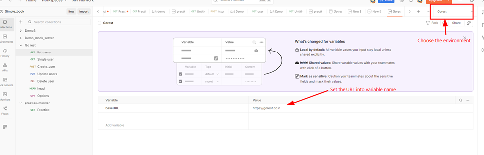

*Figure 1 Environment Setup*

## **9.2 Add a New Request**

Click **"+"** to open a new request tab and give a name

## **9.3 GET Requests**

### **9.3.1** Fetching List of Users

- Endpoint: /users

- Method: GET

- Description: Retrieves the list of all users.

- Payload: None

- Steps: Send the GET request and check the response.

- Expected Result: A list of all users from the GoREST server is
  returned.

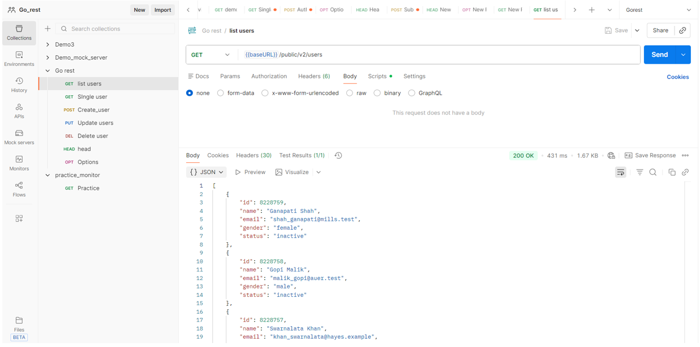

*Figure 2 List of Users*

### **9.3.2 Fetching a Single User**

- Endpoint: /users/{user_id}(Paste the user ID of one user obtained from
  the above Get request)

- Method: GET

- Description: Retrieves details of a specific user using their ID.

- Payload: None

- Steps: Copy a user ID from the previous response, send the GET
  request.

- Expected Result: Detailed information about that specific user is
  returned.

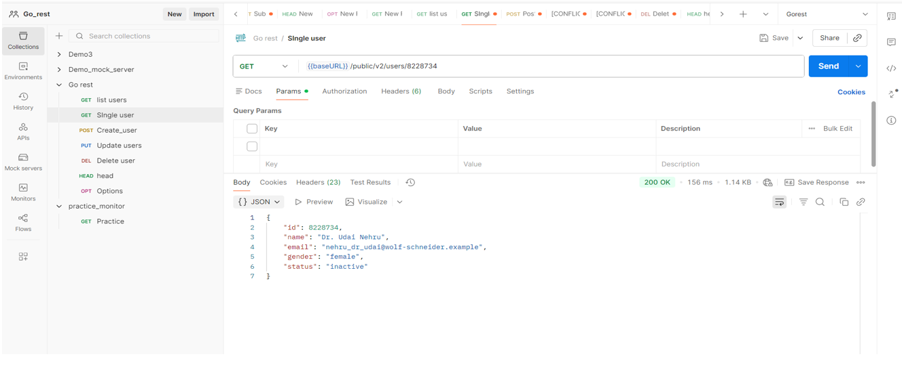

*Figure 3 Single User*

## **9.4 POST Request**

**Creating a New User**

- Endpoint: /users

- Method: POST

- Description: Creates a new user in the system.

- Headers: Authorization: Bearer \<your_token\>

- Body (raw → JSON):\
  {

\"name\": \"John Doe\",

\"email\": \"john.doe@example.com\",

\"gender\": \"male\",

\"status\": \"active\"

> }

- Steps: Send the request with the payload.

- Expected Result: The server successfully creates a new user.

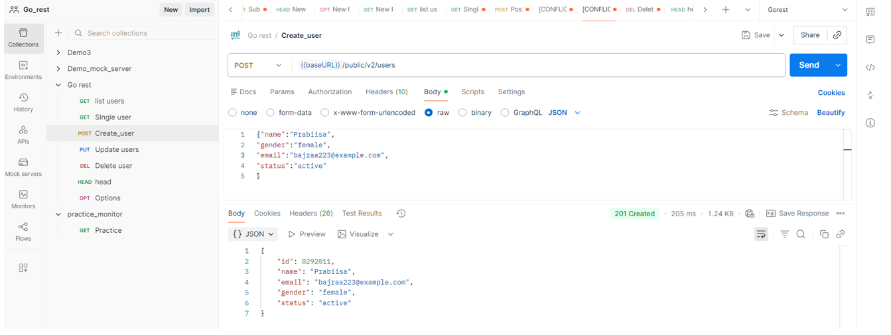

*Figure 4 Create User*

## **9.5 PUT Request**

## **Updating an Existing User**

**Updating an Existing User**

- Endpoint: /users/{user_id}(Paste the user ID obtained from the POST
  request)

- Method: PUT

- Description: Updates an existing user's information.

- Headers: Authorization: Bearer \<your_token\>

- Body (raw → JSON):

{

\"name\": \"John Doe Updated\",

\"email\": \"john.updated@example.com\",

\"gender\": \"male\",

\"status\": \"active\"

}

- Steps: Enter the user ID in the URL, update the required fields in the
  Body, and send the request.

- Expected Result: The user information is updated successfully.

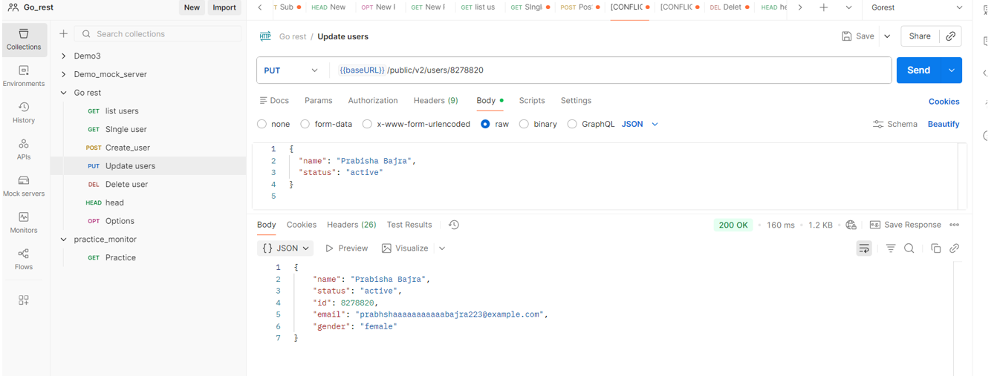
*Figure 5: Updating a user*

## **9.6 DELETE Request**

**Removing a User**

- Endpoint: /users/{user_id}(Paste the user ID obtained from the POST
  request)

- Method: DELETE

- Headers:Authorization: Bearer \<your_token\>

- Payload: None

- Steps: Enter the user ID in the URL and send the request.

- Expected Result: The user is removed successfully.

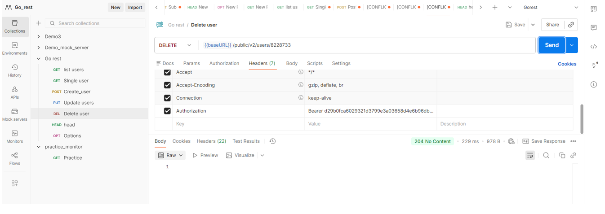

*Figure 6 Deleting a user*

## **9.7 OPTIONS Method**

**Checking Allowed Methods**

- Endpoint: /users

- Method: OPTIONS

- Payload: None

- Steps: Send the OPTIONS request.

- Expected Result: The Allow field in the response headers shows all
  HTTP methods supported by the endpoint.

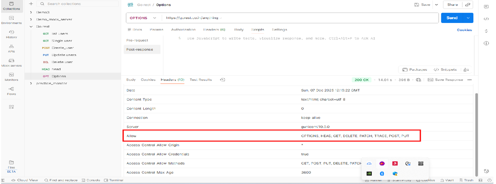

*Figure 7 Showing options*

## **9.8 HEAD Method**

**Retrieving Header Information**

- Endpoint: /users

- Method: HEAD

- Payload: None

- Steps: Send the HEAD request.

- Expected Result: Only header information is returned (e.g., content
  type, content length), with no response body.

> 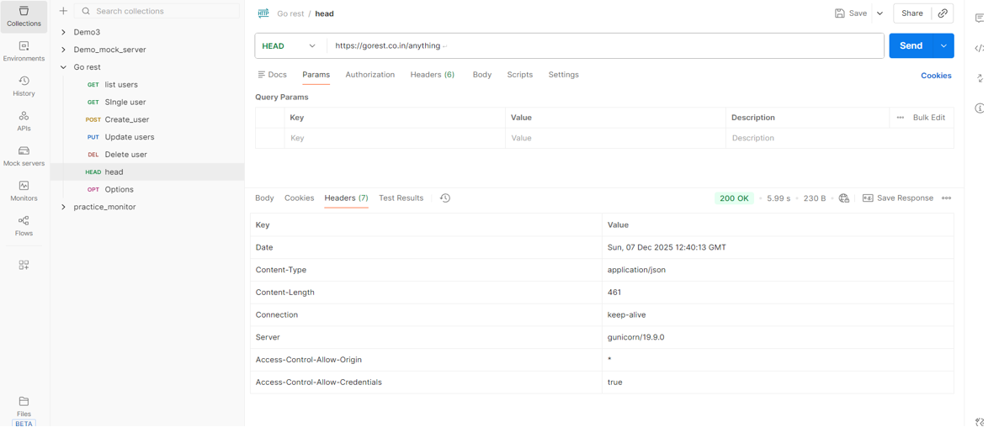

*Figure 8 Head option*

# **10. Executing API Methods Using Postman CLI (Newman)**

This section demonstrates how the same API requests (GET, POST, PUT,
DELETE, OPTIONS, and HEAD) created earlier using the Postman GUI are
executed using the Postman CLI (Newman). No new requests are created;
the existing collection is reused.

## **10.1 Check Node.js Installation**

Postman CLI (Newman) requires [[Node.js]{.underline}](http://node.js).

Steps:

1.  Open Command Prompt / Terminal

2.  Type command: ```node -v```

3.  If installed, it shows a version number like v18.19.0

> 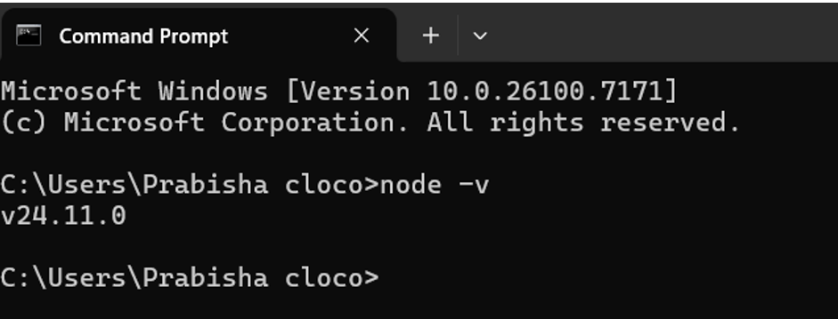

*Figure 9 Node.js version displayed in the command prompt*

4.  If not installed, download from [[Node.js official
    site]{.underline}](https://nodejs.org/) and install

## **10.2 Install Newman**

After installing Node.js, Newman can be installed globally using the
Command Prompt / Terminal.

Steps:

1.  Open Command Prompt / Terminal.

2.  Run the following command:

```
npm install -g newman
```


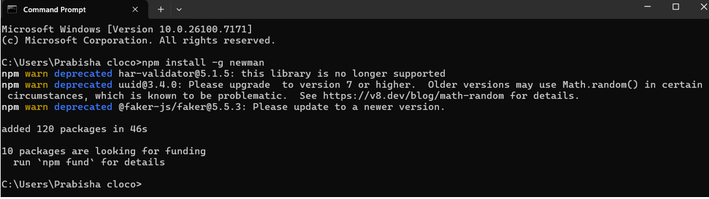

*Figure 10 Installation of newman*

3.  Run the below command to check the installed Newman version.

```
newman -v

```


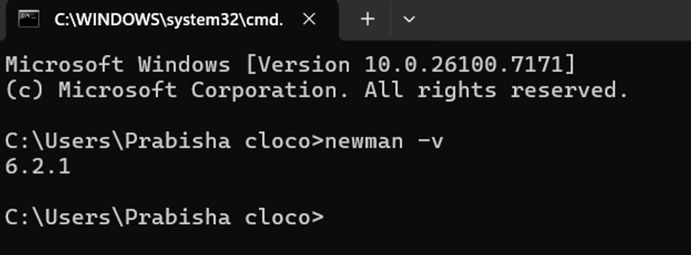

*Figure 11 Version of Newman*

4\. If the version number is displayed, Newman has been installed
successfully.

## **10.3 Export Existing Collection & Environment**

1.  Open Postman and select the existing collection containing:

- GET (List Users, Single User)

- POST (Create User)

- PUT (Update User)

- DELETE (Remove User)

- OPTIONS

- HEAD

2.  Click Export → save as .json

3.  Export the environment file with variables like base_url → save as
    .json

4.  Save both the collection and environment files in the same folder on
    your device to easily execute them using Newman.

## **10.4 Running All Methods via Postman CLI**

Execute the collection using Newman on the Command Prompt / Terminal.

Steps:

1.  Open Command Prompt / Terminal on your device.

     - Navigate to the folder where the exported collection and environment files are saved.

    - Example if saved on Desktop, Enter the command :\
  ```cd %USERPROFILE%\\Desktop```

2.  Run Newman command:

```newman run "Go rest.postman_collection.json\" -e "Gorest.postman_environment.json```

Explanation:

- run → Executes the collection

- GoRest_API_Collection.json → Exported collection

- -e → Environment file

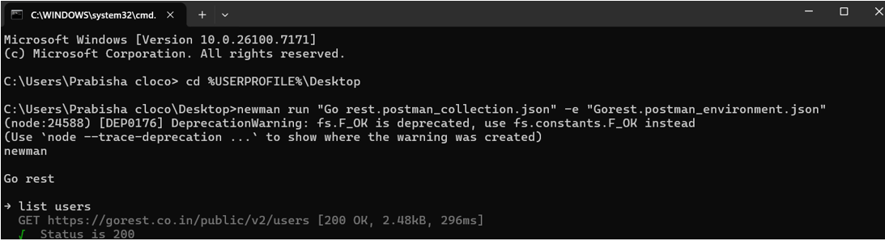

*Figure 12 Running All Methods via Postman CLI*

## **10.5 Execution Flow**

Newman sequentially runs:

1.  GET list of users

2.  GET single user

3.  POST create a new user

4.  PUT update user

5.  DELETE remove user

6.  OPTIONS to check allowed methods

7.  HEAD to retrieve headers

Here is a screenshot of the result:

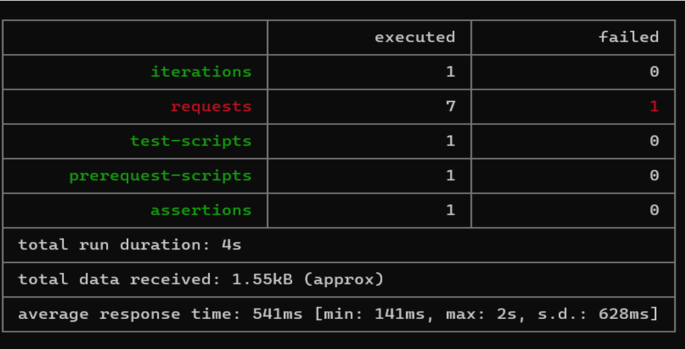

*Figure 9 Summary of Newman collection run results.*
